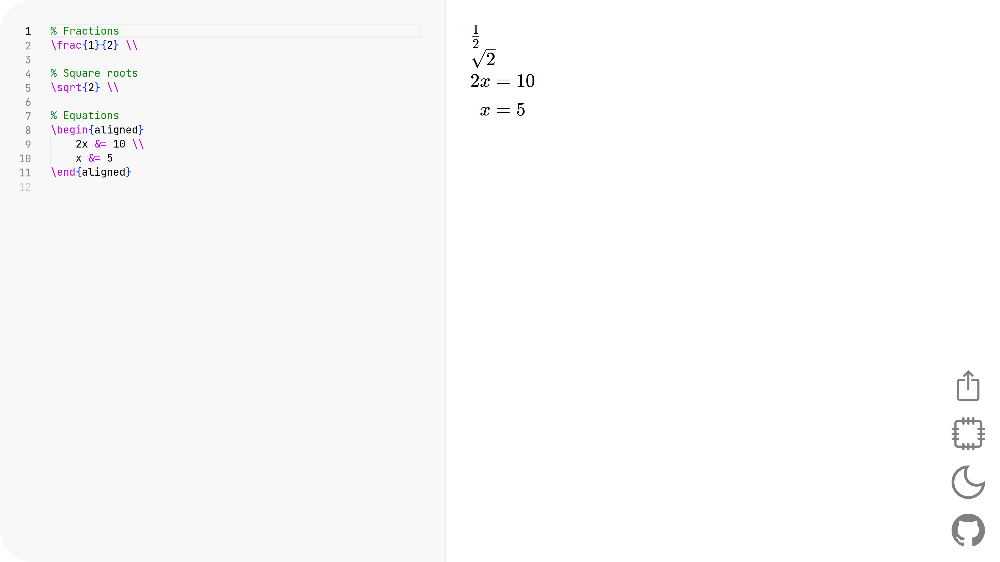

# mathedit

mathedit is a website for editing and exporting LaTeX math. 
It's kinda' like Code Cogs' (multiple?) editors and similar, but with some notable improvements:
- Rendering happens client-side for speed and privacy (as does the whole website)
- mathedit uses the Monaco editor (aka VSCode!), and includes syntax highlighting, auto-complete, and snippets
- The preview uses KaTeX specifically, which is kinda' annoying because MathJax is still needed for exporting (and they have slight syntax variations), but means you get super fast previews
- It's free and open source :)

You can try out the website at [mathedit.dev](https://mathedit.dev)

## Stuff used
[Vite](https://vitejs.dev/) + [Svelte](https://svelte.dev/) for the website itself 
[Monaco](https://microsoft.github.io/monaco-editor/) for the the actual LaTeX editor 
[KaTeX](https://katex.org/) for the preview because it's really fast 
[MathJax](https://www.mathjax.org/) for the export tab because KaTeX can't export to SVG 
[Coloris](https://coloris.js.org/) for the color picker in the export tab
